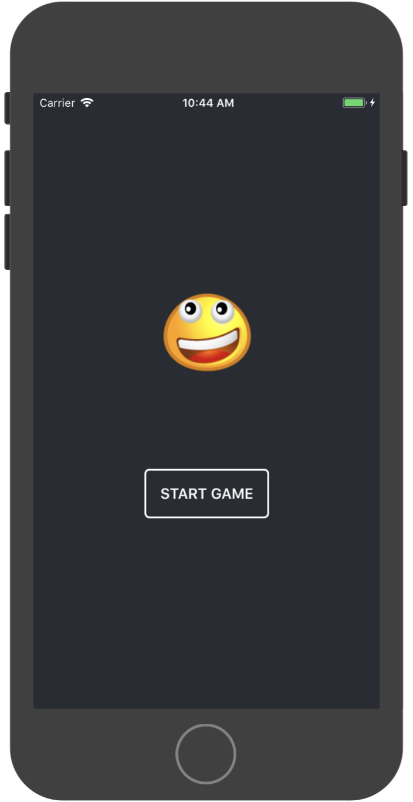
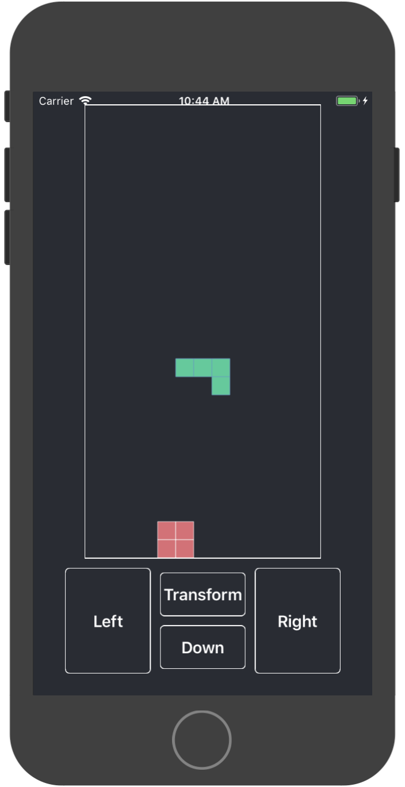
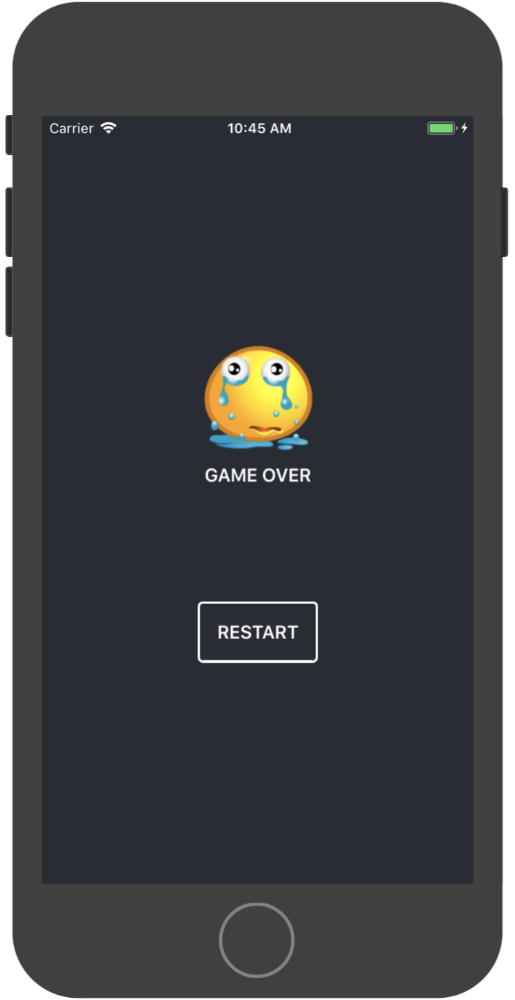

# RNTetris
使用ReactNative开发的俄罗斯方块小游戏，支持Android与iOS。

# Android下载

> 扫描二维码安装应用

# 运行方法
1. clone代码并进入项目根目录
2. 运行npm install
3. 使用react-native run-android运行项目到Android设备上
4. 在iOS上运行，需要用Xcode打开ios/RNTetris.xcodeproj文件，然后将node_modules/react-native/Libraries/ART/ART.xcodeproj拖到项目的Libraries中，并在Xcode的Linked Frameworks and Libraries中添加libART.a后才能正常运行

# 截图

  
  
  

  
  
  

